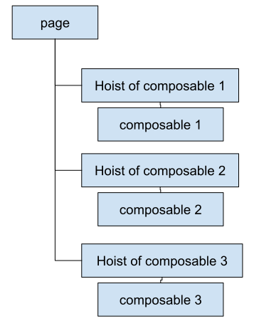
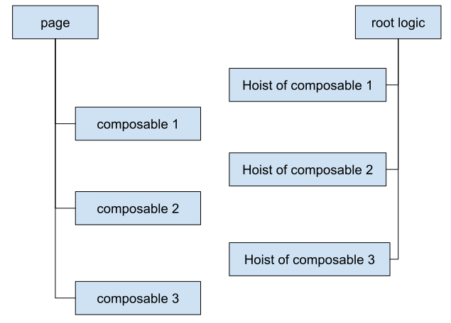

# Android sample app

# Problem
It's started when [P.Y.](https://twitter.com/Piwai/status/1564751077798322176?s=20&t=O5ZodUa-_Qtph979HYlGcQ) in Twitter shared this tweet and his post,

which is a correct complain about introducing a new set of race conditions to Android apps
by using `WhileSubscribed()`. He wrote [a post](https://py.hashnode.dev/whilesubscribed5000),
which is basically a reply to [a post from the Android Developers blog](https://medium.com/androiddevelopers/things-to-know-about-flows-sharein-and-statein-operators-20e6ccb2bc74)
by Manuel Vivo. The problem in the core is that by using AAC ViewModel we don't know the scope
of the logic related to each of composable functions in the view! Notice the scope of each
composable function in the view is not reliable as the configuration changes would end the scope,
where it should not be, because the logic should survive the configuration change. But on the other
hand, the scope of ViewModel itself is too long for the logic of each composable function!

The [next tweet](https://twitter.com/JakeWharton/status/1571588910005850115?s=20&t=O5ZodUa-_Qtph979HYlGcQ) that is related to this repository is

As you can see my first reaction was that we need to keep the ViewModels, but Jake is right.

# Solution
In this sample I tried Jake's solution to the problem, which I think is the [Molecule library](https://github.com/cashapp/molecule).
It's a very simple app that have just one page, but by adding a number on it, we'll use it to make
this app a multiple page app.

Before this, we separated the logic of composable functions by using state hoisting, where
you can find more details in [Jetpack Compose basics](https://developer.android.com/codelabs/jetpack-compose-basics).
The tree of the views was looking like this.

But as we mentioned before lifetime of the logic is wider than the lifetime of the view, so we can
separate the hoist composable functions. 

Where the logic composable functions live longer than the view composable functions. But it cannot
happen unless we share `Action` and `State` object between them to be able to decouple them and put
them on different trees. Also we rename hoists to presenters, as it's suggested in the
[Molecule library](https://github.com/cashapp/molecule).

So in the end, we have four trees, where two of them, the view and logic trees, are trees that
is built with Jetpack Compose, and the other two trees, the state and action trees, is built
by simple object references. You can find the root of logic, state, and action trees in the [RootLogic.kt](https://github.com/hadilq/molecule-sample-app/blob/main/app/src/main/java/com/example/compose_playground/RootLogic.kt)
file. Also the root of the view tree is in the [Main.kt](https://github.com/hadilq/molecule-sample-app/blob/main/app/src/main/java/com/example/compose_playground/Main.kt) file.

Please feel free to give me your feedback in Twitter, or make an issue, or a PR on this repository.
Hope it solves some problems and makes our life easier.
